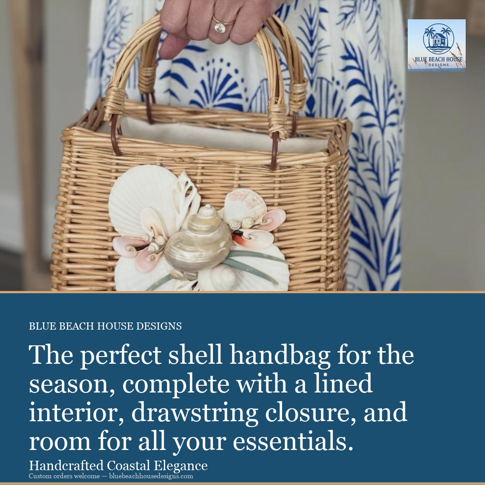
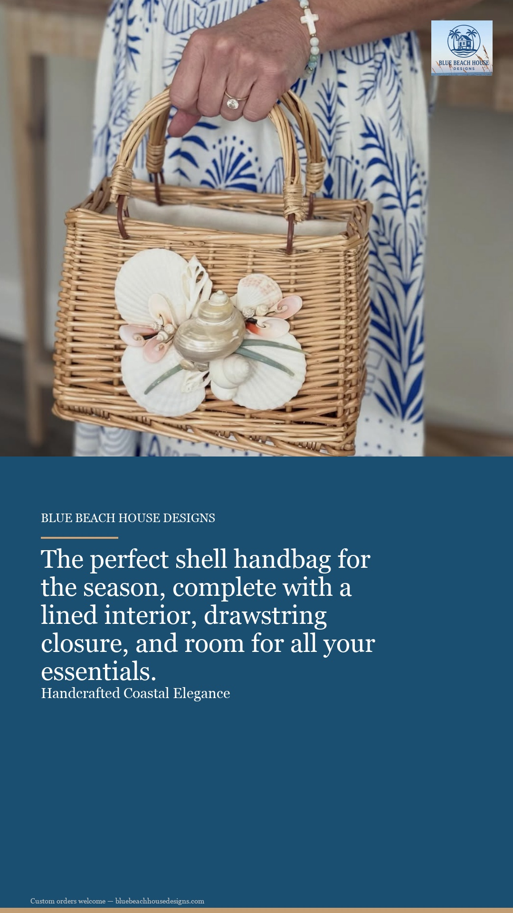
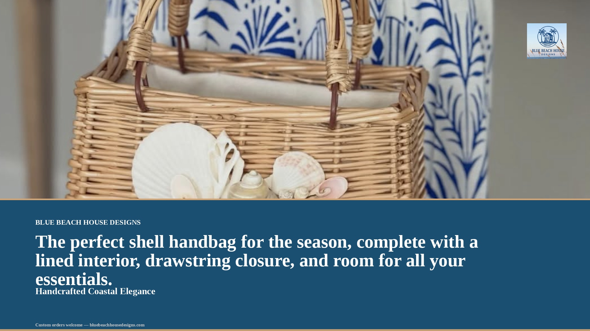

# 🎨 AdForge

**Creative automation pipeline for localized social campaigns.**

**Generate dozens of on-brand, localized ad creatives from a single campaign brief — in seconds.**


---

## 🏖️ The Client Scenario

> **Client:** [BlueBeachHouseDesigns.com](https://bluebeachhousedesigns.com) — A Charleston, SC handcrafted shell artist launching hundreds of localized social ad campaigns targeted to Southern Florida interior designers monthly.

**Challenge:** Manually creating and localizing creative variants for hundreds of campaigns per month is slow, expensive, and error-prone.

**Solution:** AdForge automates the entire creative pipeline — from campaign brief to validated, localized ad creatives ready for Instagram, Stories/Reels, and Facebook.

### ⚡ One Brief → 18 Campaign-Ready Creatives in 4.2 Seconds

---

## ✨ Pipeline at a Glance

```
 📋 INGEST        Parse & validate the campaign brief (YAML/JSON)
      │
      ▼
 🔍 ANALYZE       Score brief quality (92/100) + suggest improvements
      │
      ▼
 📂 RESOLVE       Find existing hero images or mark for generation
      │
      ▼
 🎨 GENERATE      Create missing heroes via GenAI (parallel)
      │
      ▼
 🖼️ COMPOSE       Apply layout template + text + logo + i18n
      │
      ▼
 ✅ VALIDATE      Check brand colors, logo, prohibited words, legal
      │
      ▼
 📊 REPORT        Console summary + JSON + interactive HTML dashboard
```

**Input:** 1 YAML brief + product photos

**Output:** 3 products × 3 ratios × 2 languages = **18 creatives**, all brand-compliant and organized

---

## 🖼️ Sample Output

Generated from the Blue Beach House Designs campaign brief using real product photography.

### Resort Shell Handbag — All 3 Aspect Ratios (English)

| Instagram 1:1 | Stories/Reels 9:16 | Facebook 16:9 |
|:---:|:---:|:---:|
|  |  |  |
| Editorial layout | Split panel layout | Editorial layout |

### Localized Variants — Spanish 🇪🇸

| Cowrie Shell Box (ES) | Painted Shell Art (ES) |
|:---:|:---:|
|  |  |

Each creative includes: brand name, campaign message (translated), tagline, logo, legal disclaimer, and accent bar.

<details>
<summary>📁 Full output folder structure</summary>

```
output/coastal_collection_2025/
├── report.json
├── report.html
├── resort-shell-handbag/
│   ├── hero_base.png              # ♻️ Reused from input
│   ├── instagram_square/
│   │   ├── creative_en.jpg        # 1080×1080
│   │   └── creative_es.jpg
│   ├── stories_reels/
│   │   ├── creative_en.jpg        # 1080×1920
│   │   └── creative_es.jpg
│   └── facebook_landscape/
│       ├── creative_en.jpg        # 1920×1080
│       └── creative_es.jpg
├── cowrie-shell-box/
│   └── ... (same structure)
└── painted-shell-art/
    └── ... (same structure)
```

</details>

---

## 🚀 Quick Start (3 Steps)

**Prerequisites:** Python 3.9+ · No API keys needed for demo

```bash
# 1. Clone & install
git clone https://github.com/slysik/adforge.git
cd adforge
python3 -m venv venv && source venv/bin/activate
pip install -r requirements.txt

# 2. Generate sample input assets
python create_sample_assets.py

# 3. Run the pipeline
python -m src.cli generate sample_briefs/beach_house_campaign.yaml --mock
```

**That's it.** Open `output/coastal_collection_2025/report.html` in your browser for the interactive dashboard.

### Web UI (optional)

```bash
streamlit run src/app.py
```

### Real GenAI Providers (optional)

```bash
# Google Imagen 4.0 (free tier available)
export GEMINI_API_KEY=your-key
python -m src.cli generate sample_briefs/beach_house_campaign.yaml

# Adobe Firefly Services
export FIREFLY_CLIENT_ID=your-id
export FIREFLY_CLIENT_SECRET=your-secret
python -m src.cli generate sample_briefs/beach_house_campaign.yaml -p firefly

# OpenAI DALL-E 3
export OPENAI_API_KEY=sk-your-key
python -m src.cli generate sample_briefs/beach_house_campaign.yaml -p dalle
```

---

## 📋 Campaign Brief Example

The pipeline accepts YAML or JSON. Here's the Blue Beach House Designs brief:

```yaml
campaign:
  name: "Coastal Collection 2025"
  brand: "Blue Beach House Designs"
  message: "The perfect shell handbag for the season..."
  tagline: "Handcrafted Coastal Elegance"
  target_region: "Southern Florida — Naples & Palm Beach"
  target_audience: "Home decor designers, interior stylists, ages 30-60"
  languages: [en, es]

  brand_guidelines:
    primary_colors: ["#1B4F72", "#F5E6CA", "#FFFFFF"]
    accent_color: "#D4A574"
    font_family: "Georgia"
    logo_path: "input_assets/logo.png"
    prohibited_words: ["cheap", "fake", "plastic", "mass-produced"]
    required_disclaimer: "Custom orders welcome — bluebeachhousedesigns.com"

  products:
    - id: "resort-shell-handbag"
      name: "Resort Shell Handbag"
      hero_image: "input_assets/resort-shell-handbag.png"  # ♻️ reused
      keywords: [shell handbag, rattan bag, coastal fashion]
    - id: "cowrie-shell-box"
      name: "Bespoke Rattan Cowrie Shell Box"
      hero_image: "input_assets/bespoke-rattan-cowrie-shell-box.png"
    - id: "painted-shell-art"
      name: "Painted Shell Art"
      hero_image: null  # 🎨 generated via GenAI

  aspect_ratios:
    - { name: instagram_square,   ratio: "1:1",  width: 1080, height: 1080 }
    - { name: stories_reels,      ratio: "9:16", width: 1080, height: 1920 }
    - { name: facebook_landscape, ratio: "16:9", width: 1920, height: 1080 }
```

Full file: [sample_briefs/beach_house_campaign.yaml](sample_briefs/beach_house_campaign.yaml)

---

## 🔍 Brief Analysis Engine

Before generating anything, AdForge scores the brief on 4 dimensions and provides actionable recommendations:

```
╭──────────── Brief Analysis ──────────────╮
│ Brief Quality Score: 92/100 (A)          │
│   [██████████████████░░]                 │
│                                          │
│   Completeness:   25/25  ████████████    │
│   Clarity:        20/25  ████████░░░░    │
│   Brand Strength: 25/25  ████████████    │
│   Targeting:      22/25  ██████████░░    │
╰──────────────────────────────────────────╯

✓ Strengths:
  • 3 products defined
  • Multi-language campaign (en, es)
  • Hyper-local region targeting: Southern Florida
  • Brand palette defined (3 colors) + accent color
  • Logo, prohibited words, disclaimer configured
  • Full platform coverage: Instagram, Stories, Facebook

🎨 Creative Direction:
  seasonal, coastal/nautical, design-professional
```

This demonstrates **GenAI as a judgment tool** — the AI evaluates strategy quality, not just generates pixels.

---

## 🎭 Layout Templates

5 composition templates, auto-selected by content signals:

| Template | When Auto-Selected | Visual Style |
|:---------|:-------------------|:-------------|
| **Product Hero** | Default | Full-bleed hero + gradient + text overlay |
| **Editorial** | Long messages (>40 chars) | 60/40 hero/text split with brand panel |
| **Split Panel** | Vertical 9:16 formats | 50/50 image + dark branded text panel |
| **Minimal** | Luxury/premium keywords | Centered hero, generous whitespace |
| **Bold Type** | Short messages (≤20 chars) | Oversized typography on tinted hero |

Auto-selection logic:

```python
if luxury_keywords:  → MINIMAL       # "premium", "gold", "velvet"
if short_message:    → BOLD_TYPE     # ≤20 characters
if vertical_format:  → SPLIT_PANEL   # 9:16 stories/reels
if long_message:     → EDITORIAL     # >40 characters
else:                → PRODUCT_HERO  # safe default
```

Override with `--template <name>` on the CLI.

---

## ✅ Brand Compliance & Legal Checks

Every generated creative is validated before delivery:

| Check | Method | What It Catches |
|:------|:-------|:----------------|
| **Brand Colors** | Pixel sampling (every 10th pixel) | Missing palette colors |
| **Logo Presence** | Compositor flag + pixel verification | Logo missing or paste failed |
| **Prohibited Words** | String match on all rendered text | "cheap", "fake", etc. |
| **Legal Terms** | Regulatory term flagging | "guaranteed", "miracle", "#1" |

Results embedded in every asset's metadata:

```json
{
  "brand_compliance": {
    "status": "passed",
    "notes": [
      "[Colors] All brand colors detected in image.",
      "[Logo] Logo verified in top-right region.",
      "[Text] No prohibited words detected."
    ]
  }
}
```

---

## 🏗️ Architecture

```
┌──────────────────────────────────────────────┐
│       CLI (click)  /  Web UI (Streamlit)     │
└──────────────────┬───────────────────────────┘
                   │
┌──────────────────▼───────────────────────────┐
│         Pipeline Orchestrator                │
│  Ingest → Analyze → Resolve → Generate →     │
│  Compose → Validate → Report                 │
└─┬────┬────┬────┬────┬────┬────┬──────────────┘
  │    │    │    │    │    │    │
  ▼    ▼    ▼    ▼    ▼    ▼    ▼
Models Analyzer Providers Templates Compositor Validator Report
(Pydantic) (scoring) (abstraction) (5 layouts) (Pillow) (brand) (JSON+HTML)
                 │
       ┌─────────┼─────────┬──────────┐
       ▼         ▼         ▼          ▼
   Firefly    Imagen    DALL-E 3    Mock
   Services   4.0                  (test)
```

### Module Inventory (11 modules, ~2,400 lines)

| Module | Purpose |
|:-------|:--------|
| `models.py` | Pydantic schemas — enforces ≥2 products, hex colors, ISO language codes |
| `pipeline.py` | 7-stage orchestrator — parallel generation, progress bars, metrics |
| `providers.py` | Provider abstraction — Firefly → Gemini → DALL-E → Mock auto-resolution |
| `analyzer.py` | Brief quality scoring — heuristic + optional LLM augmentation |
| `templates.py` | 5 layout templates — auto-selected by content, ratio, keywords |
| `compositor.py` | Image composition — resize, text overlay, logo, gradient, translation |
| `validator.py` | Brand compliance — color pixels, logo region, prohibited words, legal |
| `storage.py` | File management — organized output, hero discovery, asset reuse |
| `tracker.py` | Performance metrics — per-stage timing, API calls, cost estimation |
| `report.py` | Reporting — Rich console table, JSON, interactive HTML dashboard |
| `analytics.py` | Campaign analytics — sample KPIs, CTR/CPA, winner detection |

---

## 🔌 Provider Architecture

```
┌────────────────────────────────────────────┐
│          ImageProvider (ABC)                │
│     generate() → (PIL Image, Metadata)     │
└───┬────────┬────────┬────────┬─────────────┘
    │        │        │        │
┌───▼──┐ ┌───▼──┐ ┌───▼──┐ ┌──▼───┐
│Fire- │ │Imagen│ │DALL-E│ │ Mock │
│fly   │ │4.0   │ │3     │ │      │
│      │ │      │ │      │ │$0.00 │
│$0.04/│ │Native│ │$0.04/│ │      │
│image │ │ratio │ │image │ │No API│
│      │ │      │ │      │ │needed│
│v3 API│ │      │ │3 size│ │      │
│Gen   │ │      │ │      │ │Determ│
│Expand│ │      │ │      │ │inistc│
│Fill  │ │      │ │      │ │      │
└──────┘ └──────┘ └──────┘ └──────┘
```

**Auto-resolution:** Firefly → Gemini → Mock. Pipeline always runs.

The `FireflyProvider` models the actual Firefly Services REST API:
- **Text-to-Image** (`/v3/images/generate`) — hero generation
- **Generative Expand** (`/v3/images/expand`) — aspect ratio adaptation
- **Style Reference** — brand-consistent generation
- **IMS Authentication** — `client_credentials` grant with auto-refresh

---

## 📊 Performance Tracking

Every pipeline run tracks timing, cost, and provider details:

```
                    Pipeline Performance
┏━━━━━━━━━━━━━━━━━━━━━━━━━━━┳━━━━━━┳━━━━━━━┳━━━━━━━━━━━┓
┃ Stage                     ┃ Time ┃ Items ┃ API Calls ┃
┡━━━━━━━━━━━━━━━━━━━━━━━━━━━╇━━━━━━╇━━━━━━━╇━━━━━━━━━━━┩
│ brief_ingestion           │  5ms │     1 │         0 │
│ brief_analysis            │  0ms │     1 │         0 │
│ compose_resort-shell-ha…  │ 1.4s │     6 │         0 │
│ validate_resort-shell-h…  │ 1.4s │     6 │         0 │
│ compose_cowrie-shell-box  │ 1.4s │     6 │         0 │
│ validate_cowrie-shell-b…  │ 1.4s │     6 │         0 │
│ compose_painted-shell-a…  │ 1.4s │     6 │         0 │
│ validate_painted-shell-…  │ 1.4s │     6 │         0 │
│ TOTAL                     │ 4.2s │       │         0 │
└───────────────────────────┴──────┴───────┴───────────┘
```

---

## 🌐 Web UI

```bash
streamlit run src/app.py
```

| Feature | Description |
|:--------|:------------|
| 📋 Campaign overview | Brief metadata, analysis scores, product details |
| 🖼️ Creative gallery | Side-by-side ratio comparison per product |
| ✅ Approval queue | Per-asset approve/reject with comments + JSON export |
| 📈 Performance analytics | Sample KPIs with CTR, CPA, winner detection |
| 📊 Pipeline metrics | Stage timing, cost breakdown, provider info |
| 🚀 Live execution | Run the full pipeline from the browser |

---

## 🧪 Tests

**158 tests** across 10 modules:

```bash
python -m pytest tests/ -v
```

| Module | What It Tests | Count |
|:-------|:-------------|------:|
| `test_models.py` | Pydantic schema enforcement | 14 |
| `test_generator.py` | Mock generation, dimensions | 7 |
| `test_compositor.py` | Composition, text, branding | 14 |
| `test_validator.py` | Brand colors, logo, legal | 17 |
| `test_pipeline.py` | End-to-end integration | 12 |
| `test_storage.py` | File management, slugs | 5 |
| `test_providers.py` | Provider factory, fallback | 14 |
| `test_analyzer.py` | Brief scoring, enrichment | 17 |
| `test_templates.py` | Template rendering, selection | 14 |
| `test_tracker.py` | Metrics tracking | 4 |
| `test_analytics.py` | KPIs, winner detection | 40 |

---

## 🧠 Key Design Decisions

**1. Firefly-First Provider Architecture**
The provider abstraction models a production deployment where Adobe Firefly is the primary generator. Swapping any provider is a config change, not a refactor.

**2. GenAI as Judgment, Not Just Generation**
The brief analyzer uses AI to evaluate strategy quality *before* any image is generated. It scores completeness, flags weak messaging, and enriches prompts with audience/region context.

**3. Template System Over Single Layout**
Real creative teams use different layouts for different placements. Auto-selection based on content signals encodes creative judgment into code.

**4. Composition Over Text-in-Image**
Campaign text is composited via Pillow, not baked into GenAI prompts. This gives exact typographic control and instant language switching without regenerating.

**5. Contrast-Safe Panel Colors**
The split-panel template auto-selects the darkest brand color (by luminance) for text panels, guaranteeing readable white text regardless of palette.

**6. Cost Tracking From Day One**
Every stage is timed and costed. Client-facing creative automation needs cost visibility per campaign, per asset, per API call.

---

## 🔮 Production Extension Points

| Capability | Current (POC) | Production |
|:-----------|:-------------|:-----------|
| Image Generation | Mock / Gemini / DALL-E | Adobe Firefly Services |
| Asset Storage | Local filesystem | AEM DAM / S3 / Azure Blob |
| Brief Management | YAML files | Adobe GenStudio / CMS |
| Translation | Curated lookup table | TMS (Smartling / Transifex) |
| Brand Assets | Local files | Creative Cloud Libraries |
| Compositing | Pillow | Photoshop API / Express |
| Approval | Web UI queue | Workfront / Slack workflows |
| Analytics | Sample KPIs | Ad platform APIs + dashboards |
| Deployment | CLI / Streamlit | App Builder + webhooks |

---

## 📂 CLI Reference

```bash
# Generate creatives
python -m src.cli generate <BRIEF> [OPTIONS]
  --mock              No API keys needed
  -p, --provider      firefly | gemini | dalle | mock
  -t, --template      product_hero | editorial | split_panel | minimal | bold_type
  -o, --output-dir    Output directory (default: output)
  --no-analysis       Skip brief analysis
  -v, --verbose       Debug logging

# Analyze brief quality
python -m src.cli analyze <BRIEF> [--llm]

# Validate brief schema
python -m src.cli validate <BRIEF>

# List available providers
python -m src.cli providers
```

---

## 🎬 Demo Script (2–3 Minute Video)

Follow these steps for the required demo video:

**Setup (30 sec)**
1. Show terminal: `git clone`, `pip install`, `python create_sample_assets.py`
2. Show `sample_briefs/beach_house_campaign.yaml` — point out products, region, brand rules
3. Show `input_assets/` — real product photos that will be reused

**Run the Pipeline (60 sec)**
1. Run: `python -m src.cli generate sample_briefs/beach_house_campaign.yaml --mock`
2. Walk through the console output:
   - Brief analysis score: **92/100**
   - Asset resolution: 3 heroes reused from input
   - Composition progress bar
   - Brand compliance: all ✓ passed
   - Performance table: **18 creatives in 4.2 seconds**
   - Time saved: **4.4 hours** vs manual
   - ZIP package created

**Show the Output (60 sec)**
1. Open `output/coastal_collection_2025/report.html` in browser
   - Overview tab: stats, pipeline flow, warnings
   - Assets tab: filter by product, see all 18 creatives
   - Analysis tab: brief score breakdown + recommendations
   - Performance tab: per-stage timing, per-asset metrics
2. Open the output folder — show organized `product/ratio/creative_lang.jpg`
3. Show a 1:1 vs 9:16 vs 16:9 side-by-side — different templates auto-selected
4. Show English vs Spanish variants — same image, translated text

**Bonus (if time permits)**
- `streamlit run src/app.py` — show the web UI with approval queue
- `python -m src.cli analyze sample_briefs/summer_campaign.yaml` — brief scoring standalone
- `python -m pytest tests/ -v` — flash the 158 passing tests

---

## 💬 What I'd Say in the Interview

> *"AdForge is deliberately scoped as a proof of concept. The architecture decisions — provider abstraction, brief analysis, template system, cost tracking — are chosen to show how I'd build this for a real client, not just for a demo. Every module has a clear production extension point, and every design choice has a reason I can defend."*

For the full post-mortem and evolution story, see [LEARNINGS.md](./LEARNINGS.md).

---

**Built for the Adobe FDE – Creative Technologist Assessment**

[ADFORGE_INTENT.md](./ADFORGE_INTENT.md) · [LEARNINGS.md](./LEARNINGS.md) · [EVALUATION.md](./EVALUATION.md)
